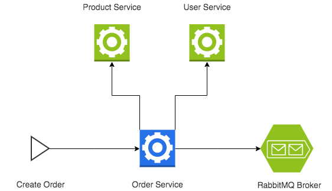

# System Design Document

## Introduction
The order manager system consists of one micro service responsible to, receiving one user id and one product code, retrieve the needed information to create a new order from multiple APIs and publish it in a message broker.

## Architecture
<p align="center">
  
</p>
The system consists of five entities:

### Order Manager API
The system responsible to receive the request from outside the system with the basic desired information, hydrated the request with more information from Product Service and User Service; store this information in a Postgres database and publish this information in a RabbitMQ message broker.

### Product Service API
An API that can return information about a desired product.

### User Service API
An API that can return information about one desired user

### Postgres database
A database that will store the information for the desired order.

### RabbitMQ
A message broker that will receive one message with the desired order. This message can be consumed by other systems

## Data Design
### Postgres
Postgers is an SQL database that can store persistent information. It has only one table, "orders", that is where we store our orders. The table schema is as follow
| Attribute         | Type     | Description                                     |
|-------------------|----------|-------------------------------------------------|
| id                | serial         | Order identifier                                |
| user_id           | varchar(250)   | User Identifier                                 |
| product_code      | varchar(250)   | Product Identifier                              |
| customer_fullname | varchar(250)   | A combination of the user's first and last name |
| product_name      | varchar(250)   | Name of the product                             |
| total_amount      | FLOAT          | Price of the product                            |
| created_at        | timestamp      | Date and time when the order was created        |

### RabbitMQ
RabbitMQ is a message broker system that implements the AMQP protocol. The order management publishes the message with the desired order in an exchange called "orders". This exchange publishes the message in a queue called "orders". The schema of the message is as follows
*Message Schema*
    ```json
    {
        "producer": "STRING",
        "sent_at": "DATETIME",
        "type": "STRING",
        "payload": {
            "order": {
                "order_id": "STRING",
                "customer_fullname": "STRING",
                "product_name": "STRING",
                "total_amount": "FLOAT",
                "created_at": "DATETIME"
            }
        }
    }
    ```

## Proposals
Right now we don't have any kind of authentication on order management, what would allow any user that has access to its endpoint to make a request. If necessary, some kind of authentication, like Basic Auth, could be implemented

If the message can't be published at the broker, order management will abort the saving on Postgres. But this can be an issue if the broker state is not stable. One way to enhance this would be to implement one circuit breaker while publishing the message at the broker

Order Management is generating metrics and logs, but there is no one to retrieve them. Another system responsible to generate the metrics and expose them could be created, using kibana, ElasticSearch and Logstash